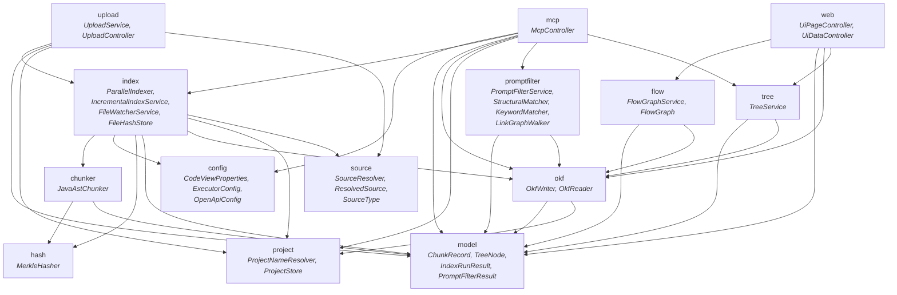
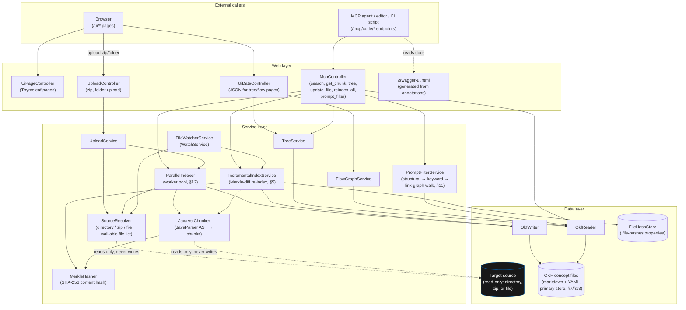

# Diagrams

Both diagrams below are derived directly from the actual source (`grep`-ed import statements and
controller/service wiring), not hand-drawn from memory — see the note at the end of each section
for how to regenerate them if the code changes.

## 1. Package dependency graph

Every arrow below is a real `import com.codeview.app.*` found in the source at the time this was
generated. No package here imports back "up" the arrow direction — there are no cycles.



**Reading this:** `model` and `okf` are still the two packages everything else eventually depends
on. The new addition is `project` — every package that writes or reads OKF data now depends on it
too (`okf`, `index`, `upload`, `mcp`), since that's what turns a project name into (and validates)
an actual filesystem path. `project` itself has zero CodeView dependencies, same as `source` and
`hash` — it's a leaf utility package, deliberately kept that way so it can be depended on from
everywhere without creating a cycle.

**To regenerate this if the code changes:**
```bash
cd src/main/java/com/codeview/app
for pkg in $(find . -mindepth 1 -maxdepth 1 -type d | sed 's|./||'); do
  echo "=== $pkg ==="
  grep -rhoE "import com\.codeview\.app\.[a-z]+" "$pkg" | sed 's/import com.codeview.app.//' | sort -u | grep -v "^$pkg$"
done
```

## 2. Whole-application architecture / request flow



**What this makes visible that the package graph doesn't:** the target source is only ever touched
by `SourceResolver` and `JavaAstChunker`, both strictly read-only (dotted lines) — no arrow points
*into* `TargetRepo`. Every write in the system goes to `OkfStore` or `FileHashStore`, both of which
this application owns and created itself. That's the "no source code changes" constraint (Architecture
Plan §2) made structurally visible rather than just asserted in a doc comment.
